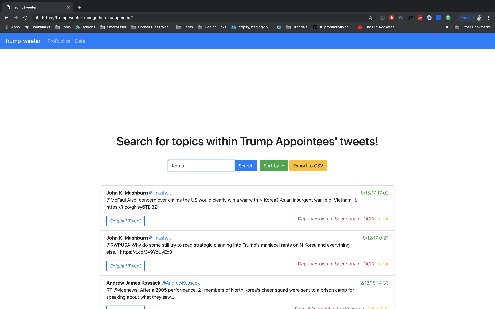

# TrumpTweeter  --  [Demo](https://trumptweeter-mongo.herokuapp.com/)

___

Twitter has become the premier source for real-time updates from politicians and their appointees. One problem, however, is that there are thousands of appointees in Washington and it would be impossible to look them all up by oneself.

With TrumpTweeter, you can bulk search topics through a curated database of trump's political appointees. A powerful tool built for engaged citizens and journalists.

This fullstack web app was initially designed and built over the course of a two day hackathon called Tech, Media and Democracy. After the hackathon, I spend a number of weeks fixing bugs, improving the UX and increasing the overall quality of the app.

